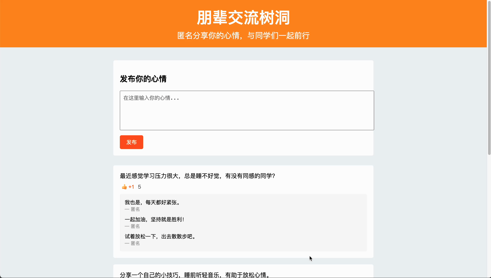

## 设计思维与实践作业

本项目是“设计思维与实践”课程的作业，旨在通过设计和实现**五个**不同的网页应用，解决大学生在学习和生活中遇到的实际问题，帮助同学们更好地规划自己的学业和职业发展，同时缓解压力，合理“躺平”。

项目共分为五个部分，分别对应五个功能模块：

1. **学生任务管理系统**
2. **个性化职业发展规划服务**
3. **毕业通—你的安全躺平指南**
4. **朋辈交流树洞**
5. **悠然校园：校园生活活动规划与记录**

---

### 一、学生任务管理系统（task1.html）


**功能描述：**

- **任务管理：** 导师可以通过该系统管理学生的待办任务，将任务量化和可视化，合理分配学生的工作量。
- **任务过载提醒：** 系统会根据学生的任务数量，判断是否过载。当任务过多时，会在页面中显示哭泣表情，提醒导师注意学生的压力。
- **悬赏任务：** 对于临时的紧急任务，导师可发布悬赏任务。愿意接受任务的学生可以自行领取，避免任务分配不合理，让每个学生都有权利顺利且安全地“躺平”。

**实现细节：**

- **学生列表：** 页面左侧显示学生名单，点击学生姓名可查看其具体任务。
- **任务展示：** 右侧内容区域展示选定学生的任务，包括任务标题、优先级、截止日期等信息。
- **悬赏任务功能：** 导师可添加悬赏任务，设置奖励金额和截止日期。学生可在自己的任务列表中查看并接受悬赏任务。
- **任务状态表情：** 根据学生的任务数量，动态显示表情。如果任务过多，显示哭泣表情；任务适中，则显示开心的表情。

---

### 二、个性化职业发展规划服务（task2.html）


**功能描述：**

- **1V1咨询：** 根据每个同学的专业背景、就业意向、已完成工作、兴趣爱好等，提供一对一的个性化职业发展规划服务。
- **阶段性任务制定：** 从长远目标出发，逆向制定阶段性任务，帮助同学们明确自身的发展路径，减少弯路和无用功。
- **价值最大化：** 通过合理规划，用最少的精力实现价值最大化，有助于同学们安心“躺平”。

**实现细节：**

- **学生卡片：** 页面展示多个学生的咨询请求卡片，包括基本信息、研究方向、咨询问题和希望预约的时间。
- **回复功能：** 导师可以点击“回复学生”按钮，弹出回复框，填写建议或安排预约时间。
- **回复状态：** 导师回复后，按钮状态会变为“已回复”，并显示回复内容，方便导师和学生跟进。

---

### 三、毕业通—你的安全躺平指南（task3.html）


**功能描述：**

- **毕业要求查看：** 帮助每个同学明确自己的毕业要求和完成进度，可查看不同专业/学院的官方毕业要求文件。
- **学长学姐反馈：** 收集已毕业或即将毕业的师兄师姐的经验分享，如“XX专业毕设通过率为95%，需要注意XXX”等。
- **进度可视化：** 提供个人毕业要求任务进度条，将毕业进度可视化，减少对“未知”的恐惧，更安心地“躺平”。

**实现细节：**

- **导航栏：** 包含首页、毕业要求、学长学姐反馈、我的进度等模块，方便用户切换查看。
- **毕业要求列表：** 详细列出毕业所需的具体要求，如学分、毕业论文、学术活动、实习实践、语言要求等。每项要求后有可勾选的复选框，勾选后显示“已完成”。
- **学长学姐反馈：** 展示不同专业的毕业经验分享，用户可滚动查看，获取实用建议。
- **我的进度：** 以进度条和列表形式，直观展示用户的毕业任务完成情况，帮助规划剩余任务。

---

### 四、朋辈交流树洞（task4.html）



**功能描述：**

- **匿名心情分享：** 提供一个匿名的心情树洞，作为同学们的情绪出口，分享日常生活中的焦虑、紧张等问题。
- **互相鼓励：** 其他有相同问题的同学可在评论区“+1”，相互鼓励，让大家知道不是“一个人在战斗”。
- **快乐经验分享：** 心态好的同学可分享自己的快乐“躺平”生存经验，帮助大家缓解焦虑情绪，在可控范围内学会、合理“躺平”。

**实现细节：**

- **发布心情：** 用户可匿名发布自己的心情和感受，帖子会显示在页面上供大家浏览。
- **点赞功能：** 每个帖子下有“👍 +1”按钮，其他同学可点击表示支持和共鸣，点赞数量实时更新。
- **评论功能：** 每个帖子下方显示模拟的评论列表，展示其他同学的反馈和互动，营造社区氛围。
- **界面优化：** 使用温暖的橙色调作为主色调，页面布局简洁友好，提升用户体验。

---

### 五、悠然校园：校园生活活动规划与记录（task5.html）


**功能描述：**

- **校园活动规划：** 通过上传个人一周的课表和任务计划，系统会根据空闲时间智能推荐适合的校园活动，如心理座谈会、运动健身、文娱活动、钓鱼、爬山等。
- **活动打卡与分享：** 同学们可与有相同兴趣的同学组局参与活动，并通过系统打卡、上传照片记录心情，形成个人成长日志。
- **活动推荐智能化：** 系统根据时间、兴趣、需求，自动匹配合适的课外活动，帮助同学们缓解科研与学习压力。

**实现细节：**

- **活动推荐模块：** 用户可以上传课表，系统自动推荐活动。页面展示活动的推荐列表，包含活动介绍和参与者分享。
- **心情日志记录：** 同学们可以在参与活动后，打卡记录心情，并与其他参与者分享活动体验和图片。
- **活动分享：** 每个活动下都有分享区，用户可以浏览他人分享，参与讨论，并上传自己的打卡记录和图片。

---

## 项目结构

```
UniversityLoungeGuide/
├── task1.html        # 学生任务管理系统
├── task2.html        # 个性化职业发展规划服务
├── task3.html        # 毕业通—你的安全躺平指南
├── task4.html        # 朋辈交流树洞
├── task5.html        # 悠然校园：校园生活活动规划与记录
├── requirements.txt  # 依赖文件（如有需要）
└── README.md         # 项目说明文件
```

## 使用说明

1. **下载项目：** 将本项目克隆或下载到本地。

2. **启动服务：**

   ```bash
   python3 -m http.server 8000
   ```

3. **打开网页：** 使用浏览器打开对应的HTML文件即可查看相应的网页应用效果。

   - 打开`task1.html`查看**学生任务管理系统**。
   - 打开`task2.html`查看**个性化职业发展规划服务**。
   - 打开`task3.html`查看**毕业通—你的安全躺平指南**。
   - 打开`task4.html`查看**朋辈交流树洞**。
   - 打开`task5.html`查看**悠然校园：校园生活活动规划与记录**。

4. **交互体验：** 各个网页均有一定的交互功能，建议实际操作体验，如点击按钮、填写表单等。

## 总结

本次作业通过设计和五个具有实际意义的网页应用，运用设计思维的方法，针对大学生在学习、毕业、职业规划和心理健康等方面的需求，提供了有效的解决方案。这些应用旨在帮助同学们更好地规划学业和职业发展，缓解压力，合理“躺平”，为大学生活提供有力的支持和指导。

---

**备注：** 本项目为课程作业示例，所有数据均为模拟，实际应用中需要结合后台开发和数据库支持。
